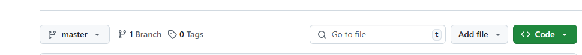
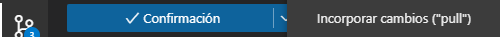

# APUNTES GITHUB BÁSICO

Está es mi chuleta para subir proyectos desde local, descargarlos desde GitHub, y poder ir actualizando  últimas versiones.

## IMPORTANTE

Si tu proyecto no tiene inicializado GIT por defecto, como si lo tiene un proyecto de symfony, lo tendrás que inicializar en tu proyecto y crearle el archivo correspondiente **.gitignore**.

***

Escribe este comando en tu cmd:

```shell
git init
```

A continuación crea el archivo .gitignore

***

## Proyecto en local¿cómo lo subo a GitHub?

> Primer paso, creamos un nuevo archivo en nuestro proyecto llamado **README** con extension md, que es indispensable siempre que trabajemos con **GITHUB**.
>> Segundo paso, entramos a nuestro GitHub, creamos un repositorio con el nombre del proyecto **IMPORTANTE : NO AÑADIMOS NADA AL CREAR EL REPOSITORIO EN GITHUB**.
>>> Tercer paso, copiamos la URL del repositorio que acabamos de crear para subir nuestro proyecto.


>>>> Cuarto paso, escribir comando en nuestro cmd para subir proyecto:

```shell
git remote add master/main(según el que tengas) origin http......(URL COPIADA)
```

 Para verificar que haya ejecutado correctamente la URL remota, ejecutamos el siguiente comando:

```shell
git remote -v
```

 Para enviar los cambios de su repositorio local a GitHub, ejecute el siguiente comando.

```shell
 git push -u origin master

```

## Proyecto en GitHub¿cómo lo subo a local?

> Primer paso, en tu directorio de GitHub encontrarás un botón verde llamado **code** a la derecha, haz click y copia la direccón URL.
>> Segundo paso, abrir cmd apuntando a proyectos y escribimos el comando para clonar nuestro proyecto :



```shell
git clone http....(URL COPIADA)
```

>>> Tercer paso, tu proyecto se guardará sin var y vendor lo cual genera un error, para eso **reconstruimos** nuestro proyecto con el siguiente comando:

```shell
composer install
```

## Trabajar actualizando últimas versiones

>Primer paso, desde visual studio code, pulsamos incorporar pull.



>>Otra manera de hacerlo es escribir directamente el siguiente comando:

```shell
git pull origin master/main http....(URL COPIADA)
```
